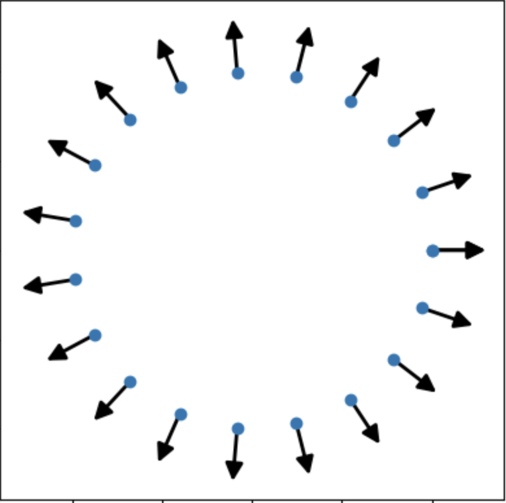
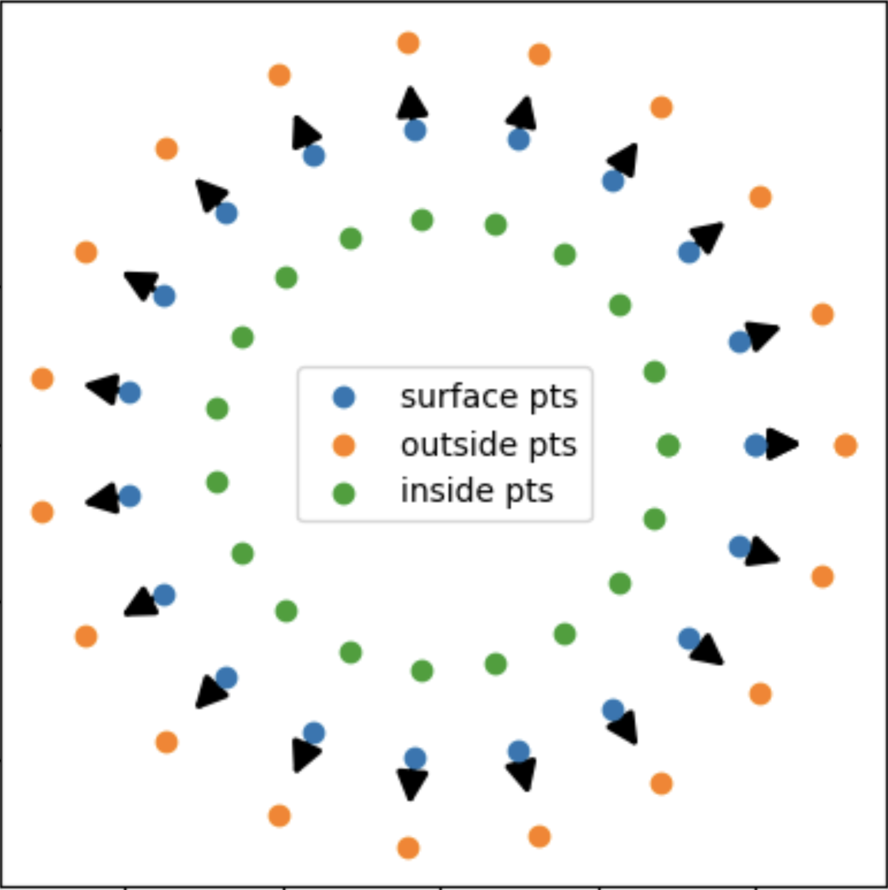
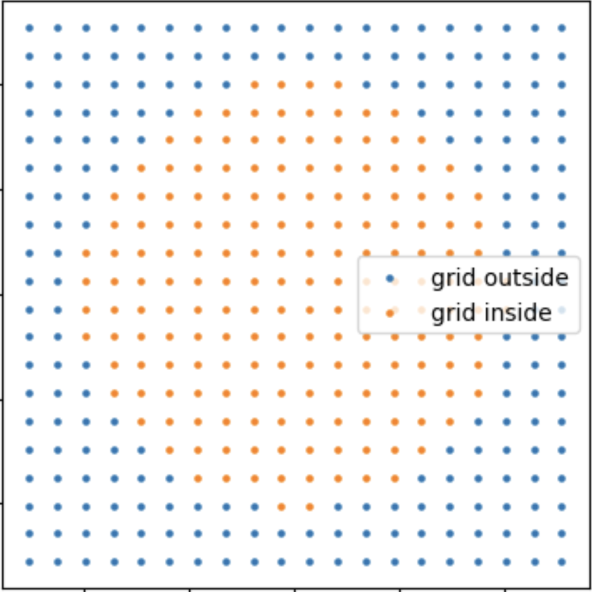
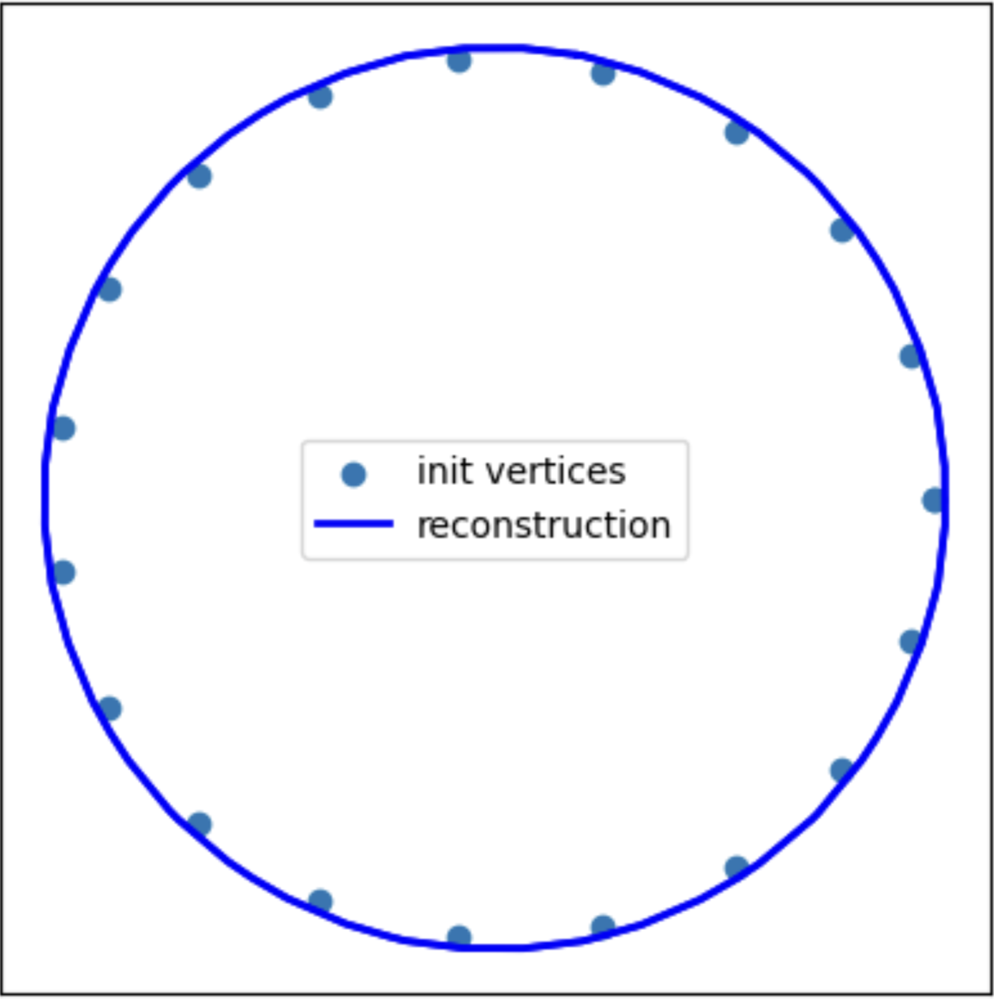
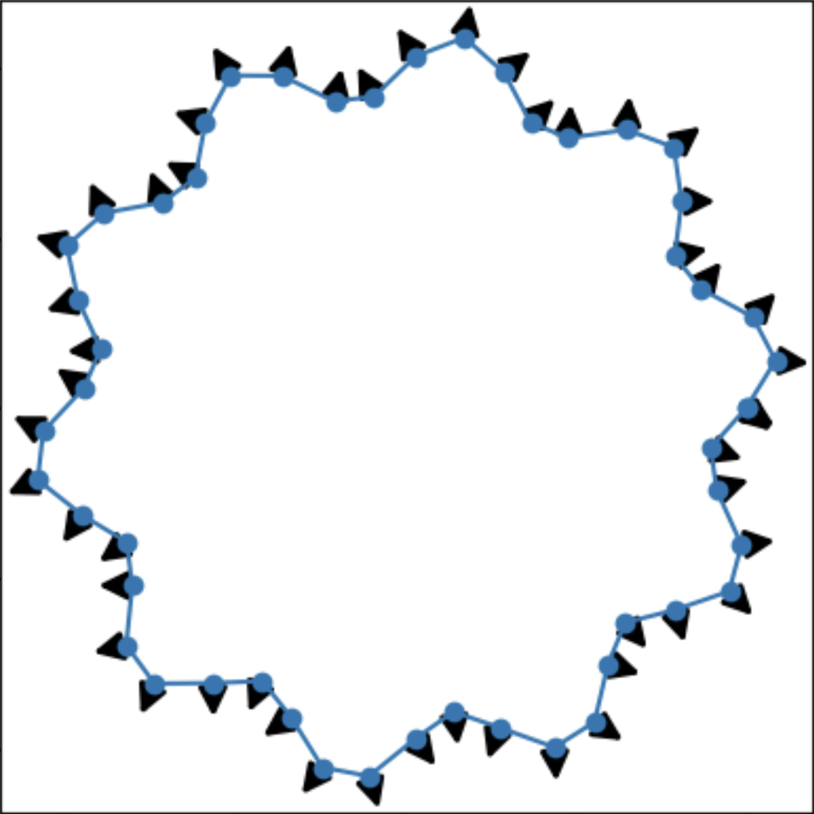
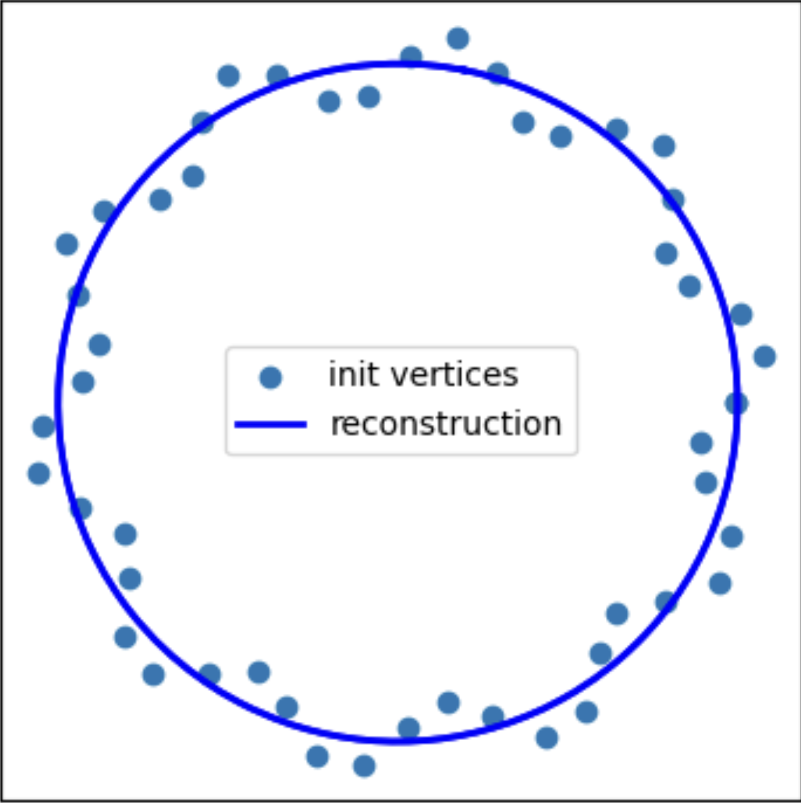
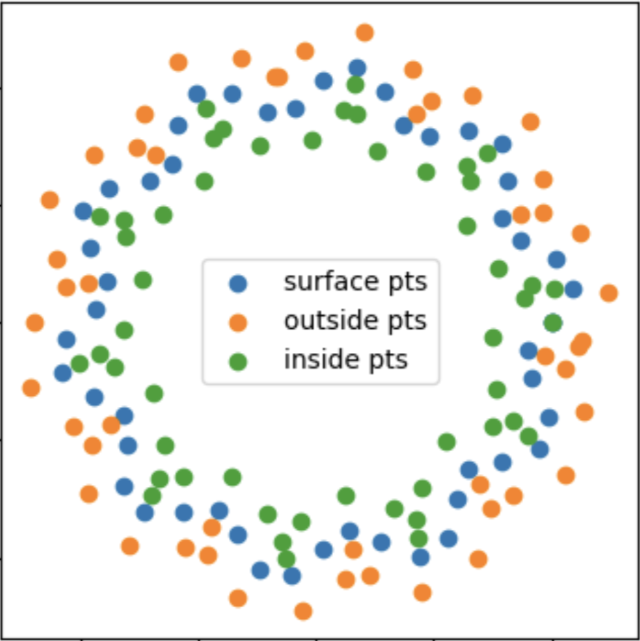
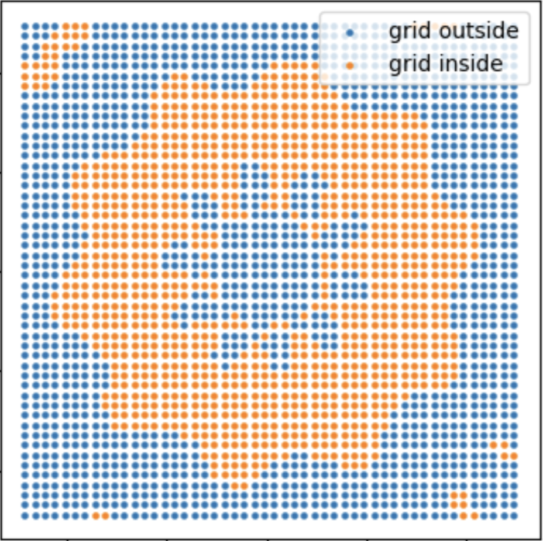
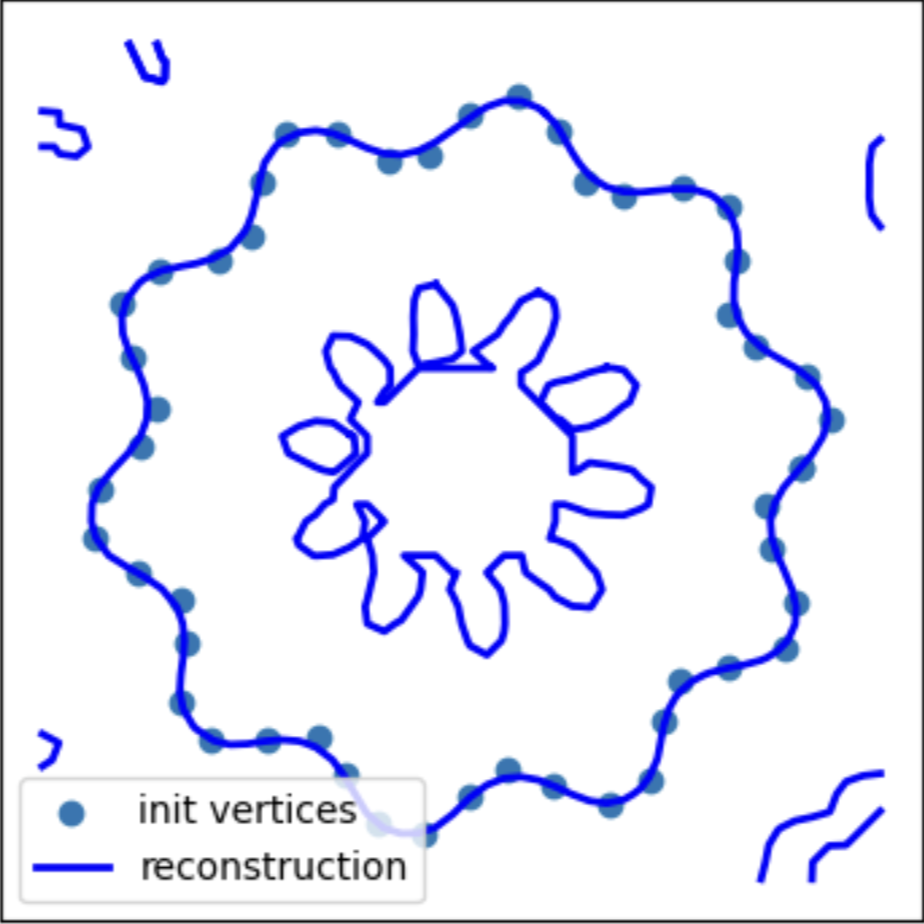
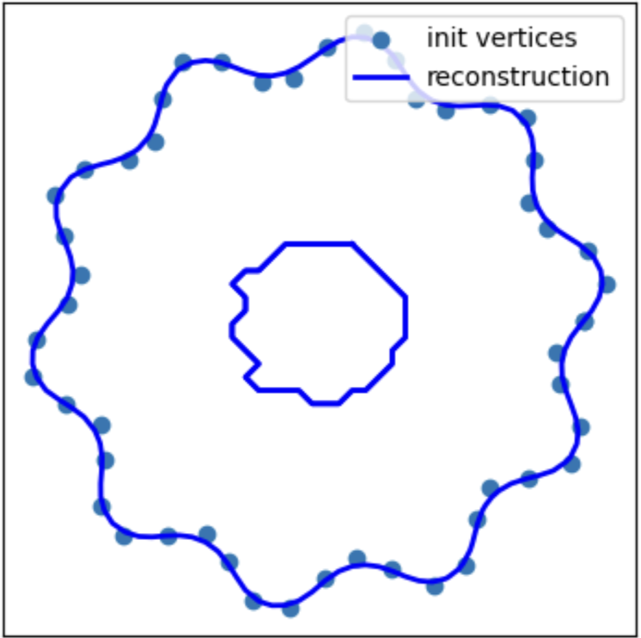

In this exercise you will:

* Compute an implicit MLS function that approximates a cloud of 2D/3D points with normals. The input points will then lie at the zero level set of the computed function.

* Sample the implicit function on a three dimensional volumetric grid.

* Reconstruct a triangle mesh / contours of the zero level set of the implicit function, by using the Marching Cubes/Squares algorithm on the grid.

* Experiment with various MLS reconstruction parameters.

## Part 1: setting up constraints
The task of this assignment is to come up with an implicit function $f(p), p = (x,y)$ defined on all of the 2D space, such that the input point cloud lies at the zero level set of this function, i.e. for any point pi in the input point cloud, we have $f(p_i) = 0$. The normals of the implicit function evaluated at the point cloud locations should agree with the normals of the point cloud (also provided as input).

The implicit function is typically interpolated from a set of given values at given points. Given the
function values $f_i$ at some given points $p_i$ (the constrained points), the function $f$ is found by solving
a minimization of the form

$$f = \arg \min_{\phi} \sum_{i} ||\phi(p_i) - f_i || $$

where $\phi(p)$ is any acceptable function (such as any function computed via an MLS procedure). 
The first step is thus specifying those constraints. Naturally, the input point cloud should be part of the constraints, with the value of $f = 0$.
However, if the constraints only lie on the zero level set, most interpolation schemes will only generate the zero function as a result. We thus need to introduce more constraints. 
The process for generating the constraints is as follows:

• For all point cloud points $p_i$ we know the constraint $f(p_i)$ = 0.

• Fix an ε value, for instance $ε = 0.01 ×$ bounding box diagonal.

• For each point $p_i$ compute $\hat{p_{i}} = p_i + εn_i$, where $n_i$ is the normalized normal of $p_i$. Check
whether $\hat{p_i}$ is the closest point to $p_i$ ; if not, divide ε by 2 and recompute $\hat{p_i}$ until this is
the case. Then, add another constraint equation: $f (\hat{p_i} ) = ε$.

• Repeat the same process for −ε, i.e., add equations of the form $f(\mathring{p_{i}}) = −ε$. Dont forget
to check that $\mathring{p_i}$ is the closest point to $p_i$

As a result of the steps, for the N point cloud points you get 3N equations for the
implicit function $f(x,y)$.

__Task 1__: Implement the function `sample_constraints(...)` in `task1_constraints.py` that computes the constraints as described above. The function should return a list of tuples of the form $(p_i, f_i)$, where $p_i$ is a point in the input point cloud and $f_i$ is the corresponding constraint value.

Result visualizations for simple data (circle) should look like this:

Input points & normals|  Sampled constraints
:-------------------------:|:-------------------------:
 |   

## Part 2: MLS Interpolation

Given the constraints, you can use interpolation to construct the implicit function. The function is not defined explicitly e.g. by a formula; instead it can be evaluated at any given point in 2D space. At any point, the function is computed as a weighted sum of polynomial functions defined on the constrained points, where the weights vary from one points to the other (MLS).

More specifically:

2.1 First, define a grid in space that contains the constraint points from part 1. The resolution of the grid - is a parameter to be adjusted in experiments. (it's already implemented for you)

2.2 For each node of the grid compute the value of the implicit function f(x,y) whose zero level set approximates the point cloud. Use the moving least squares approximation

* For each grid node find closest constraint vertices within a fixed radius. Check if the number of them is sufficient to build a polynomial of chosen degree 

* Find parameters of a polynomial that approximates the values of the constraint vertices
    
* Evaluate the polynomial at the grid node.

 __Task 2__: 
 Please implement the missing part of `global_predictor(...)` function in `task2_solver.py`. 

1) First, convert grid and constraint points into required polynomial basis (degree). You may use transform_to_polynomial_basis function for this

2) Then solve linear least squares problem. Optimizations problem:\
$X \cdot c = v$\
$`c = \text{argmin}_{c}  \sum_i  ||v_i - x_i \cdot c||_2^2`$
\
$c = ...$ - use analytical solution described in class (linear least squares) \
\
Where:
\
$X$ (matrix) - constraint point in polynomial basis (constr_pts) \
$x$ (vector) - constraint point in polynomial basis (constr_pts[i]) \
$v$ (vector) - the implicit function values in constraints points (constr_vals[i]) \
$c$ (vector) - coefficients of the polynomial (that approximates the shape)

3) Finally, interpolate implicit function in the grid points, e.g.:\
$g$ - a grid point (grid_pts[i])\
$\hat v$ - the predicted value at the grid point\
$\hat v = g \cdot c$
 

Result visualizations for simple data (circle) should look like this:

 Inference on a grid | Isosurface Reconstruction 
:-------------------------:|:-------------------------:
  | 

 ## Part 3: Local model
 Okay, now lets see how the model from above will work on a bit more complicated:

 Input points & normals|  Reconstruction
:-------------------------:|:-------------------------:
 |   

As you can see the model is not strong enough to approximate the data. \
Instead of increasing the complexity of the model (the degree of polynomial) we can build many local polynomial approximators.\
So the algorithm is following:

- For each grid node find closest (in a fixed radius) constraint points.
- Check if the number of them is sufficient to build a polynomial of chosen degree.

__Task 3.1__: \
Please implement part of  `local_predictor(...)` in `task2_solver.py`. You need to find nearest neighbours in a fixed radius

Given a grid point, it's nearest constrain points and constraint values, build polynomial (of specified degree) that approximates the constraint points in the local space. The optimization problem for each grid point is:
\
$`c = \text{argmin}_{c}  \sum_{x_i \in N_X(g)}  w_i * ||v_i - x_i \cdot c||_2^2`$\
$c = ...$ - use analytical solution described in class (weighted linear least squares)
\
\
$g$ - grid point in polynomial basis (grid_pts[i])\
$N_X(g)$ - nearest constraint points in the neighbourhood of grid point $g$  \
$x_i$ (vector) - constraint point in polynomial basis (constr_pts[i]) \
$v_i$ (vector) - the implicit function values in constraints points (constr_vals[i]) \
$c$ (vector) - coefficients of the polynomial (that approximates the shape)\
\
Note that we'll build __weighted__ least squares. This means that error at each of the constraint points will be weighted. The weight is the wendland function (is implemented in `task2_solver.py`). The smaller the distance between the grid and the constraint point is the bigger is the weight term for this point\
$w_i$ (scalar) - the weight of the constraint point. $w_i$ = wendland(distance($g$, $x_i$))

Finally, interpolate implicit function in the grid points, e.g.:\
$\hat v$ - the predicted value at the grid point $g$\
$\hat v = g \cdot c$

__Task 3.2__: Please implement part of  `eval_grid_point(...)` in `task2_solver.py`. 

The result of local model on a more complicated data should look like this:

 Sampled constrains | Inference on a grid | Isosurface Reconstruction 
:-------------------------:|:-------------------------:|:-------------------------:
  |  | 

The model approximates the data, but has some noise. Let's regularize the model.

__Task 3.3__:
Please add regularization for optimization in  `eval_grid_point(...)` in `task2_solver.py`. 

$` c = \text{argmin}_{c}  \sum_{x_i \in N_X(g)}  w_i * ||v_i - x_i \cdot c||_2^2  + |c|_2^2 `$

Final results:

 Inference on a grid | Isosurface Reconstruction 
|:-------------------------:|:-------------------------:
   | 

Note: we will not address the "floater" in the middle of the plot; it happens because the middle points are too far from the constraints.
The easiest way to fix it is to discard connected components whose average distance from the data is larger than some threshold.